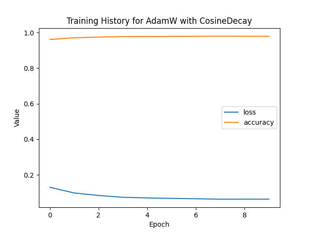

# Optimizers-from-Scratch 🚀

This project implements **training a tiny MLP on MNIST without using autograd**, with manual forward/backward propagation, multiple optimizers, and learning rate schedules.  
The goal is both educational (understanding matrix calculus + optimization) and practical (reaching ≥97% test accuracy on MNIST).  

---

## 📌 Problem Statement
We want to train a **2-layer MLP** on MNIST (or Fashion-MNIST) by manually coding backpropagation and optimization algorithms.  
The challenge is to implement everything from scratch:
- Forward and backward passes with matrix calculus
- Optimizers: SGD, Momentum, RMSProp, Adam, AdamW
- Learning rate schedules: constant, step decay, cosine decay, warmup
- Gradient check with finite differences to ensure correctness

---

## 🧮 Mathematics

### Softmax + Cross-Entropy
Given logits $z \in \mathbb{R}^{10}$ and one-hot label $y$:

$$
\text{softmax}(z)_i = \frac{e^{z_i}}{\sum_j e^{z_j}}
$$

Loss:

$$
L = - \sum_i y_i \log \text{softmax}(z)_i
$$

Gradient wrt logits:

$$
\nabla_z L = \text{softmax}(z) - y
$$

---

### Backprop for Linear Layer
For input $x \in \mathbb{R}^{\text{batch} \times d_{in}}$,  
weights $W \in \mathbb{R}^{d_{in} \times d_{out}}$, bias $b \in \mathbb{R}^{d_{out}}$:

$$
z = xW + b
$$

Gradients:

$$
\nabla_W L = x^T \nabla_z L, \quad 
\nabla_b L = \sum \nabla_z L
$$

---

### Optimizers

**SGD**  
$$
W \leftarrow W - \eta \nabla_W
$$

**Momentum**  
$$
v \leftarrow \beta v + (1-\beta)\nabla_W, \quad 
W \leftarrow W - \eta v
$$

**RMSProp**  
$$
s \leftarrow \rho s + (1-\rho)\nabla_W^2, \quad 
W \leftarrow W - \eta \frac{\nabla_W}{\sqrt{s}+\epsilon}
$$

**Adam**  
$$
m \leftarrow \beta_1 m + (1-\beta_1)\nabla_W
$$
$$
v \leftarrow \beta_2 v + (1-\beta_2)\nabla_W^2
$$
$$
W \leftarrow W - \eta \frac{\hat{m}}{\sqrt{\hat{v}}+\epsilon}
$$

**AdamW (decoupled weight decay)**  
$$
W \leftarrow W - \eta \frac{\hat{m}}{\sqrt{\hat{v}}+\epsilon} - \eta \lambda W
$$  

✅ Unlike Adam with L2 regularization, the decay is applied **outside** the momentum updates.

---

### Learning Rate Schedulers
- **Constant LR**  
- **Step Decay**:  
  $$
  \eta \cdot \gamma^{\lfloor \tfrac{\text{epoch}}{k} \rfloor}
  $$
- **Cosine Decay**: smooth annealing to zero  
- **Warmup**: gradually increase LR for first few epochs


---

## 🏗 Model Architecture
- **Input**: 784 (flattened MNIST 28×28 image)  
- **Hidden Layer**: 256 units, ReLU activation  
- **Output Layer**: 10 classes, softmax  

---

## 📊 Results
- Achieved **≥97% test accuracy** with AdamW + cosine decay  
- Plotted:
  - Loss & accuracy curves
  - Learning rate schedules

Example training curves:



---

## 🧪 Unit Tests
Implemented a **finite-difference gradient check**:  
- Construct a random tiny MLP  
- Compare analytical backprop gradients with numerical finite differences  
- Verify correctness within tolerance (~1e-6)

---

## ⚙️ How to Run

### 1. Install dependencies

```bash

pip install tensorflow matplotlib numpy

```

### 2. Run training

```bash

python main.py

```
This will:
- Train the MLP with all optimizers × schedulers
- Save training logs to training_log.txt  
- Save plots (training_history_*.png, lr_schedule_*.png)

### Example output

```text

--- Training with Optimizer: AdamW, Scheduler: CosineDecay ---
Epoch 1 | Loss: 0.25 | Accuracy: 93.1%
...
Epoch 10 | Loss: 0.05 | Accuracy: 98.1%

```

---

## 📚 Learning Objectives
- Understand matrix calculus for backpropagation
- Implement optimizers and schedulers from scratch
- Compare their convergence behaviors
- Appreciate the role of weight decay in AdamW


